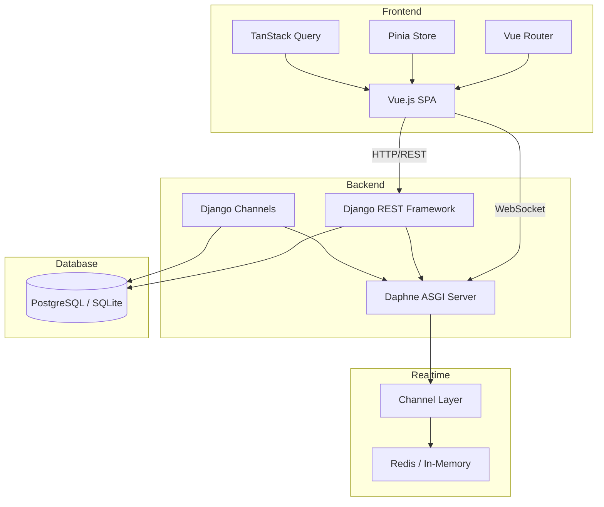
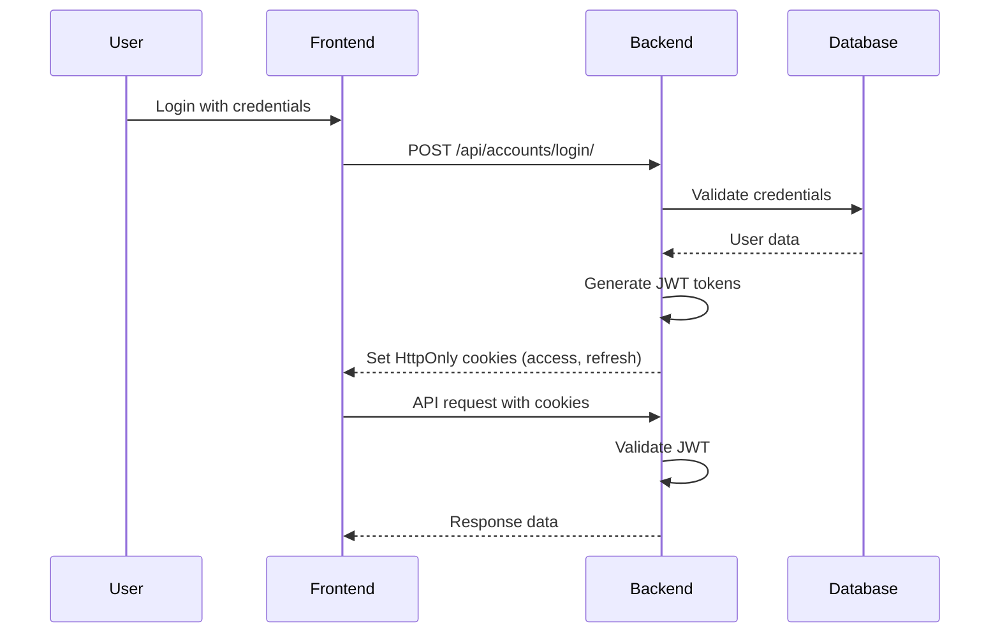
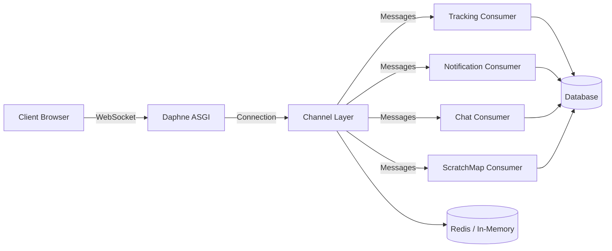
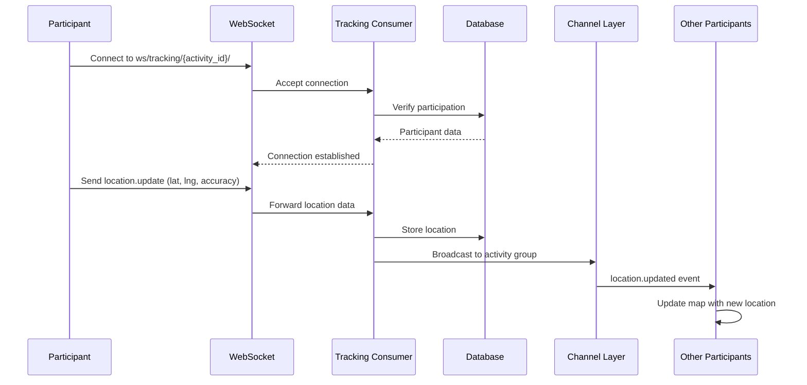

# MDVL


MDVL is a comprehensive Django/Vue application for coordinating activities, maps, checkpoints, chat, notifications, and live participant tracking. It supports the same development experience locally with SQLite or in Docker with PostgreSQL.

> **Tip**: For quick testing, you can contact [@ihmaiw2d_kc] on Telegram to get a pre-configured `.env` file for testing purposes.
>
> **Підказка**: Для швидкого тестування ви можете зв'язатися з [@ihmaiw2d_kc] в Telegram, щоб отримати готовий файл `.env` для тестування.

## Quick Feature Links

- [Activity Management](#activities--rooms) - Create and manage activities with roles and permissions
- [Live Location Tracking](#live-location-system) - Real-time GPS tracking with WebSocket updates
- [Interactive Maps](#interactive-maps) - MapLibre GL-based maps with markers and zones
- [Checkpoint System](#backend-appsmodules) - Geofenced checkpoints with QR code scanning
- [Route Planning](#route-building) - Sequential route points with completion validation
- [OSRM Routing](#osrm-routing) - External routing service for navigation
- [Group Chat](#backend-appsmodules) - Real-time activity chat
- [Meeting Points](#meeting-points) - Scheduled meeting points with notifications
- [SOS System](#sos-system) - Emergency alert system
- [Scratch Map](#scratch-map) - Personal map discovery with H3 indexing
- [Points System](#backend-appsmodules) - Earn points through activities
- [Shop System](#backend-appsmodules) - Purchase avatars and badges
- [Friend System](#friend-system) - Manage friend relationships
- [Profile Statistics](#backend-appsmodules) - Track exploration and activity stats
- [User Map Visibility](#permission-based-visibility) - Control who can see you on the map
- [Notifications](#notifications) - In-app and email notifications
- [Authentication](#authentication-system) - JWT auth with Google OAuth
- [Roles & Permissions](#roles--permissions) - Granular access control
- [Localization](#internationalization) - Multi-language support (English, Ukrainian)
- [Distance Measurements](#distance-measurements) - Measure distances on the map

---

## Table of Contents

- [Project Overview](#project-overview)
- [Main Features](#main-features)
- [Technology Stack](#technology-stack)
- [System Architecture](#system-architecture)
- [Backend Architecture](#backend-architecture)
- [Frontend Architecture](#frontend-architecture)
- [Project Directory Structure](#project-directory-structure)
- [Backend Apps/Modules](#backend-appsmodules)
- [Frontend Modules](#frontend-modules)
- [Authentication System](#authentication-system)
- [Real-time Architecture (WebSockets)](#real-time-architecture-websockets)
- [Live Location System](#live-location-system)
- [Activities / Rooms](#activities--rooms)
- [Roles & Permissions](#roles--permissions)
- [Notifications](#notifications)
- [Interactive Maps](#interactive-maps)
- [Scratch Map](#scratch-map)
- [Meeting Points](#meeting-points)
- [SOS System](#sos-system)
- [Testing](#testing)
- [Docker Support](#docker-support)
- [API Design](#api-design)
- [Design Decisions](#design-decisions)
- [Best Practices](#best-practices)
- [Getting Started](#getting-started)

---

## Project Overview

MDVL is a full-stack web application designed for activity coordination and real-time participant tracking. The platform enables organizers to create activities (rooms), define checkpoints and routes, track participant locations in real-time, facilitate group communication, and manage notifications. Participants can join activities, scan QR codes at checkpoints, view live maps, and engage with other participants through chat.

The application follows a modern decoupled architecture with a Django REST Framework backend and Vue.js 3 frontend, connected via REST APIs and WebSockets for real-time updates.

---

## Main Features

### Core Functionality
- **Activity Management**: Create and manage activities with customizable roles and permissions
- **Live Location Tracking**: Real-time GPS tracking of participants with WebSocket updates
- **Interactive Maps**: MapLibre GL-based interactive maps with markers, zones, and routes
- **Checkpoint System**: Geofenced checkpoints with QR code scanning for verification
- **Route Planning**: Define routes with sequential points for guided activities
- **Group Chat**: Real-time chat within activities
- **Meeting Points**: Scheduled meeting points with time-based notifications
- **SOS System**: Emergency alert system for participant safety
- **Scratch Map**: Personal map discovery system using H3 geospatial indexing
- **Points System**: Earn points through checkpoint visits and activities
- **Shop System**: Purchase avatars and badges with earned points
- **Notifications**: In-app and email notifications with user preferences
- **User Status**: Custom status messages (e.g., "Available", "Busy")
- **Friend System**: Add and manage friends with pending/accepted/rejected status
- **Distance Measurements**: Measure distances between points on the map
- **Localization**: Multi-language support (English, Ukrainian)

### Authentication & Authorization
- JWT-based authentication with HttpOnly cookies
- Google OAuth integration for one-click sign-in
- Email/username authentication 
- Email verification system
- Password reset functionality
- Role-based access control within activities
- Permission system for granular access control

---

## Technology Stack

### Backend
| Technology | Version | Purpose |
|------------|---------|---------|
| Python | 3.12+ | Main backend language |
| Django | 5.2 | Web framework, ORM, authentication |
| Django REST Framework | 3.17 | REST API framework |
| djangorestframework-simplejwt | 5.5 | JWT authentication |
| Daphne | 4.1 | ASGI server for WebSockets |
| Django Channels | 4.1 | WebSocket support |
| channels-redis | 4.2 | Redis channel layer (optional) |
| psycopg | 3.2 | PostgreSQL adapter |
| Pillow | 11.3 | Image processing |
| google-auth | 2.55 | Google OAuth |
| qrcode | 8.2 | QR code generation |
| h3 | 4.0 | Geospatial hexagonal indexing |
| reportlab | 3.6+ | PDF generation |
| factory-boy | 3.3+ | Test data generation |
| pytest | 8.0+ | Testing framework |
| pytest-django | 4.9 | Django pytest integration |
| pytest-cov | 6.0 | Coverage reporting |

### Frontend
| Technology | Version | Purpose |
|------------|---------|---------|
| Vue.js | 3.5 | Frontend SPA framework |
| TypeScript | 6.0 | Type safety |
| Vite | 8.0 | Build tool and dev server |
| Vue Router | 5.1 | Client-side routing |
| Pinia | 3.0 | State management |
| MapLibre GL | 5.24 | Interactive maps |
| @tanstack/vue-query | 5.101 | Data fetching and caching |
| @vueuse/core | 14.3 | Vue composition utilities |
| Tailwind CSS | 4.3 | Styling |
| Reka UI | 2.10 | UI component library |
| @lucide/vue | 1.24 | Icon library |
| @zxing/browser | 0.2 | QR code scanning |
| h3-js | 4.5 | H3 geospatial indexing (frontend) |
| vue-i18n | 11.4 | Internationalization |
| Vitest | 4.1 | Unit testing |
| Valibot | 1.4 | Schema validation |

### Infrastructure
| Technology | Purpose |
|------------|---------|
| Docker | Containerization |
| Docker Compose | Multi-container orchestration |
| PostgreSQL 16 | Production database (Docker) |
| SQLite | Development database (local) |
| Redis | Channel layer for WebSockets (optional) |

---

## System Architecture

MDVL follows a **decoupled SPA + REST API + WebSockets** architecture:



### Architecture Principles
- **Separation of Concerns**: Clear separation between frontend and backend
- **Stateless API**: RESTful API design with JWT authentication
- **Real-time Updates**: WebSockets for live data without polling
- **Database Agnostic**: Application code works with both SQLite and PostgreSQL
- **Containerized Development**: Docker support for consistent environments
- **Test-Driven**: Comprehensive test coverage with pytest and vitest

---

## Backend Architecture

### Django Apps Structure

The backend is organized into modular Django apps, each with a specific domain responsibility:

```
backend/
├── accounts/          # User authentication, profiles, Google OAuth, friends
├── activities/        # Activity management, roles, permissions, participants
├── tracking/          # Live location tracking via WebSockets
├── locations/         # Map markers, zones, meeting points
├── checkpoints/       # Checkpoints, QR codes, routes, visits
├── chat/              # Activity chat functionality
├── notifications/     # Notification system (in-app + email)
├── points/            # Points system for activities
├── scratch_map/       # Personal map discovery (H3 indexing)
├── shop/              # Shop for avatars and badges
└── shared/            # Shared utilities and serializers
```

### Key Backend Components

#### Settings Configuration
- Environment-based configuration via `.env` files
- Database engine selection (SQLite/PostgreSQL) based on `DB_ENGINE`
- JWT token configuration with cookie-based storage
- Email backend configuration (console/SMTP)
- Channel layer configuration (in-memory/Redis)

#### Authentication Flow
1. User registers or logs in via credentials or Google OAuth
2. Server validates credentials and issues JWT tokens
3. Tokens stored in HttpOnly cookies (`access_token`, `refresh_token`)
4. Token refresh handled automatically via cookie-based refresh endpoint

#### WebSocket Architecture
- ASGI application using Daphne server
- Django Channels for WebSocket handling
- Channel layer backend (in-memory for dev, Redis for production)
- Consumers for real-time features:
  - `TrackingConsumer`: Live location updates
  - `NotificationConsumer`: User notifications
  - `ChatConsumer`: Activity chat
  - `ScratchMapConsumer`: Scratch map updates

#### API Design Patterns
- RESTful endpoints under `/api/` prefix
- ViewSets for standard CRUD operations
- Custom APIView for complex operations
- Serializer-level validation
- Permission classes for access control
- Custom exception handling

---

## Frontend Architecture

### Vue.js 3 Application Structure

The frontend follows a feature-based architecture with composition API:

```
frontend/src/
├── features/
│   ├── activities/      # Activity management UI
│   ├── auth/            # Authentication pages
│   ├── chat/            # Chat interface
│   ├── checkpoints/     # Checkpoint management
│   ├── home/            # Main map interface
│   ├── locations/       # Location markers
│   ├── notifications/   # Notification UI
│   ├── shop/            # Shop interface
│   └── exploration/     # Scratch map
├── components/
│   └── ui/              # Reka UI components
├── lib/                 # Utilities and API client
├── router/              # Vue Router configuration
└── composables/         # Vue composables
```

### Key Frontend Patterns

#### State Management
- Pinia for global state (user, notifications, WebSocket connections)
- Local component state with Vue 3 composition API
- TanStack Query for server state caching and synchronization

#### Routing
- Vue Router with history mode
- Route guards for authentication
- Feature-based route organization

#### API Client
- Axios-based HTTP client
- Automatic cookie inclusion for credentials
- Error handling and retry logic

#### WebSocket Integration
- Native WebSocket API for real-time connections
- Reconnection logic with exponential backoff
- Event-driven updates to Pinia stores

#### Map Integration
- MapLibre GL for interactive maps
- Custom markers and layers
- Geospatial calculations with H3-js
- Responsive map controls

---

## Project Directory Structure

```
MDVL/
├── backend/                    # Django backend
│   ├── accounts/              # User authentication
│   ├── activities/            # Activity management
│   ├── tracking/              # Location tracking
│   ├── locations/             # Map features
│   ├── checkpoints/           # Checkpoints & routes
│   ├── chat/                  # Chat functionality
│   ├── notifications/         # Notification system
│   ├── points/                # Points system
│   ├── scratch_map/           # Scratch map
│   ├── shop/                  # Shop system
│   ├── shared/                # Shared utilities
│   ├── backend/               # Django project settings
│   ├── media/                 # User uploaded files
│   ├── staticfiles/           # Collected static files
│   ├── manage.py              # Django management script
│   ├── requirements.txt       # Python dependencies
│   ├── pytest.ini             # Pytest configuration
│   └── conftest.py            # Pytest fixtures
├── frontend/                   # Vue.js frontend
│   ├── src/
│   │   ├── features/          # Feature modules
│   │   ├── components/        # Vue components
│   │   ├── lib/               # Utilities
│   │   ├── router/            # Router config
│   │   └── composables/       # Vue composables
│   ├── public/                # Static assets
│   ├── package.json           # Node dependencies
│   ├── vite.config.ts         # Vite configuration
│   └── tsconfig.json          # TypeScript config
├── examples/                   # Example documentation
├── .env.example               # Local dev environment template
├── .env.docker                # Docker environment template
├── docker-compose.yml         # Docker services
├── Dockerfile.backend         # Backend container
├── Dockerfile.frontend        # Frontend container
└── README.md                  # This file
```

---

## Backend Apps/Modules

### accounts
**Purpose**: User authentication, profiles, and authorization

**Key Models**:
- `User`: Custom user model with email-based auth, avatar, status, OAuth provider
- `UserStatus`: Custom status messages (e.g., "Available", "Busy")
- `Friend`: Friend relationships with pending/accepted/rejected status

**Profile Statistics**:
- `hexagons_explored`: Counter for H3 cells discovered via scratch map
- `checkpoints_visited`: Counter for total checkpoints visited across all activities
- Statistics automatically incremented on relevant actions
- Displayed in public user profiles

**Key Features**:
- Email/username authentication 
- Google OAuth integration
- JWT token management with HttpOnly cookies
- Email verification
- Password reset
- Profile management
- User status system
- Friend system with request workflow

**API Endpoints**:
- `/api/accounts/register/` - User registration
- `/api/accounts/login/` - User login
- `/api/accounts/logout/` - User logout
- `/api/accounts/refresh/` - Token refresh
- `/api/accounts/profile/` - Profile management
- `/api/accounts/google-login/` - Google OAuth
- `/api/accounts/verify-email/` - Email verification
- `/api/accounts/password-reset/` - Password reset
- `/api/accounts/friends/` - Friend management

### activities
**Purpose**: Activity (room) management, roles, and permissions

**Key Models**:
- `Activity`: Main activity/room entity with status (DRAFT, ACTIVE, FINISHED, CANCELLED)
- `ActivityRole`: Custom roles within activities (e.g., "Organizer", "Participant")
- `ActivityPermission`: Permission catalog (e.g., "create_checkpoints", "view_map")
- `RolePermission`: Role-permission mapping with scope configuration
- `Participant`: Activity participants with roles and SOS status
- `JoinRequest`: Join request workflow

**Key Features**:
- Activity lifecycle management
- Custom role creation
- Granular permission system
- Join request/approval workflow
- SOS alert system
- Default role assignment

**Permission Codes**:
- `checkpoints.create` - Create checkpoints
- `locations.create` - Create locations/markers
- `routes.create` - Create routes
- `checkpoints.qrcodes.manage` - Manage QR codes
- `checkpoints.photos.upload` - Upload photos
- `meeting_points.set` - Set meeting points
- `participants.map.view` - View participants on map

### tracking
**Purpose**: Real-time participant location tracking

**Key Models**:
- `ParticipantLocation`: Current location (lat, lng, accuracy, heading, speed)

**Key Features**:
- Real-time location updates via WebSockets
- Geospatial accuracy tracking
- Permission-based visibility (who can see whom)
- Location history (via database updates)

**WebSocket Endpoints**:
- `ws://localhost:8000/ws/tracking/{activity_id}/` - Live location updates

### locations
**Purpose**: Map markers, zones, and meeting points

**Key Models**:
- `LocationMarker`: Generic map markers with photos
- `ActivityZone`: Geofenced zones with trigger actions (on_entry, on_exit)
- `MeetingPoint`: Scheduled meeting points with time windows
- `LocationMarkerPhoto`: Photos for markers

**Key Features**:
- Custom map markers
- Geofenced zones with trigger actions
- Meeting point scheduling
- Photo uploads for locations
- Zone-based notifications

### checkpoints
**Purpose**: Checkpoints, QR codes, routes, and visit tracking

**Key Models**:
- `Checkpoint`: Geofenced checkpoints with points and photos
- `CheckpointQRCode`: QR codes for checkpoints with unique tokens
- `CheckpointQRCodeScan`: Scan records
- `Route`: Named routes with main checkpoint
- `RoutePoint`: Sequential route points
- `Visit`: Checkpoint/route point visits with deviation tracking
- `CheckpointPhoto`: Checkpoint photos
- `RoutePointPhoto`: Route point photos

**Key Features**:
- Geofenced checkpoints with radius
- QR code generation and scanning
- Route planning with sequential points
- Visit tracking (automatic and manual)
- Deviation calculation from route
- Photo management
- Points system integration
- Route completion validation (must visit all points before main checkpoint)

**Route Building**:
- Routes consist of sequential RoutePoint entities
- Each route has a main checkpoint (OneToOne relationship)
- Route points are ordered by sequence_number
- Participants must visit all route points before checking in at the main checkpoint
- Distance calculation using Haversine formula
- Deviation tracking for route compliance

---

## OSRM Routing

### External Navigation Service

MDVL integrates with Project OSRM (Open Source Routing Machine) for external navigation:

**Implementation**:
- Opens external OSRM map in new browser tab
- URL format: `https://map.project-osrm.org/?loc={originLat},{originLng}&loc={destLat},{destLng}`
- Uses user's current GPS position as origin
- Uses selected checkpoint/marker as destination

**Usage**:
- Available in activity map interface
- Triggered by selecting "route to point" option on map markers
- Opens external routing service with pre-filled coordinates
- Provides turn-by-turn navigation via external service

**Features**:
- Real-time routing calculation
- Multiple routing options (fastest, shortest, etc.)
- Turn-by-turn directions
- Traffic-aware routing (via OSRM service)

> **Note**: This feature requires internet connection to access the external OSRM service. The routing calculation and display are handled by the external service, not the MDVL backend.

**Auto-checkin Configuration**:
- `CHECKPOINT_AUTO_CHECKIN_ACCURACY`: 50 meters
- `CHECKPOINT_MAX_MANUAL_ACCURACY`: 500 meters

### chat
**Purpose**: Activity group chat

**Key Models**:
- `ChatMessage`: Messages with sender, body, and timestamp

**Key Features**:
- Real-time chat via WebSockets
- Message length validation (max 2000 chars)
- Activity-scoped conversations
- Participant and owner access

**WebSocket Endpoints**:
- `ws://localhost:8000/ws/chat/{activity_id}/` - Activity chat

### notifications
**Purpose**: Notification system (in-app and email)

**Key Models**:
- `Notification`: User-scoped notifications with JSON payload
- `UserNotificationPreferences`: User notification preferences (email/in-app)

**Key Features**:
- Durable notification storage
- Real-time delivery via WebSockets
- Email delivery (configurable)
- User notification preferences
- Soft delete with `deleted_at`
- Read/unread tracking

**WebSocket Endpoints**:
- `ws://localhost:8000/ws/notifications/` - User notifications

### points
**Purpose**: Points system for activities

**Key Models**:
- `Point`: User points per activity

**Key Features**:
- Activity-specific point tracking
- Earned through checkpoint visits
- Used in shop system

### scratch_map
**Purpose**: Personal map discovery using H3 geospatial indexing

**Key Models**:
- `ScratchDiscovery`: Discovered H3 cells per user

**Key Features**:
- H3 hexagonal grid indexing
- Permanent discovery tracking
- Geospatial exploration gamification
- WebSocket updates for real-time discovery

**WebSocket Endpoints**:
- `ws://localhost:8000/ws/homemap/` - Scratch map updates

### shop
**Purpose**: Shop for avatars and badges

**Key Models**:
- `ShopItem`: Shop items (avatars, badges)
- `AvatarItem`: Avatar with icon file
- `BadgeItem`: Badge with text and color
- `UserItem`: User purchases with equip status

**Key Features**:
- Avatar and badge shop
- Points-based purchasing
- Item equipping
- Activity-specific shops

---

## Frontend Modules

### activities
**Purpose**: Activity management UI

**Components**:
- Activity list and detail views
- Activity creation and editing
- Participant management
- Role and permission configuration
- Join request handling

### auth
**Purpose**: Authentication UI

**Components**:
- Login/signup pages
- Google OAuth integration
- Email verification
- Password reset
- Profile management
- Public profile viewing

### chat
**Purpose**: Chat interface

**Components**:
- Real-time chat messages
- Message input and sending
- WebSocket integration
- Activity-scoped conversations

### checkpoints
**Purpose**: Checkpoint management UI

**Components**:
- Checkpoint list and map view
- QR code scanner
- QR code manager
- Quest modal for checkpoint completion
- Route planning interface

### home
**Purpose**: Main map interface

**Components**:
- Interactive map with MapLibre GL
- Location controls and panels
- Checkpoint panel
- Chat panel
- Location panel
- Side panel with draggable controls
- User location modal
- SOS alert banner

### locations
**Purpose**: Location management UI

**Components**:
- Location marker creation
- Zone management
- Meeting point configuration

### notifications
**Purpose**: Notification UI

**Components**:
- Notification list
- Real-time notification updates
- Notification preferences
- Mark as read/delete actions

### shop
**Purpose**: Shop interface

**Components**:
- Shop item listing
- Avatar and badge preview
- Purchase interface
- Item equipping
- Points display

### exploration
**Purpose**: Scratch map interface

**Components**:
- Personal discovery map
- H3 grid visualization
- Discovery statistics
- Real-time discovery updates

### measurements
**Purpose**: Distance measurement tools

**Components**:
- Distance measurement between map points
- Segment calculation
- Total distance tracking

---

## Authentication System

### JWT Authentication with HttpOnly Cookies

MDVL uses JWT (JSON Web Tokens) for authentication with a secure cookie-based approach:



**Flow**:
1. User logs in via `/api/accounts/login/` or `/api/accounts/google-login/`
2. Server validates credentials and issues access and refresh tokens
3. Tokens stored in HttpOnly cookies (`access_token`, `refresh_token`)
4. Access token lifetime: 15 minutes (configurable)
5. Refresh token lifetime: 7 days (configurable)
6. Automatic token refresh via `/api/accounts/refresh/`

**Security Features**:
- HttpOnly cookies prevent XSS token theft
- Token rotation on refresh
- Refresh token blacklisting after rotation
- Secure cookie flag in production

### Google OAuth Integration

**Flow**:
1. User clicks "Sign in with Google"
2. Frontend initiates Google Identity Services
3. User authenticates with Google
4. Google returns ID token
5. Frontend sends ID token to `/api/accounts/google-login/`
6. Backend validates token with Google
7. Backend creates/updates user account
8. Backend issues JWT tokens

> **Tip**: For local development, you can use Google's OAuth playground to test OAuth flows without creating a full Google Cloud project.

**Configuration**:
- `GOOGLE_OAUTH_CLIENT_ID`: Backend Google client ID
- `VITE_GOOGLE_CLIENT_ID`: Frontend Google client ID
- Google OAuth 2.0 client configured as Web Application

### Email Verification

**Flow**:
1. User registers with email
2. Backend sends verification email
3. User clicks verification link
4. Backend verifies email via `/api/accounts/verify-email/`
5. User account marked as verified

**Features**:
- Verification token generation
- Email template rendering
- Resend verification option
- Verified status required for certain actions

### Password Reset

**Flow**:
1. User requests reset via `/api/accounts/password-reset/`
2. Backend sends reset email with token
3. User clicks reset link
4. User submits new password via `/api/accounts/password-reset-confirm/`
5. Backend validates token and updates password

---

## Real-time Architecture (WebSockets)

### Django Channels Integration

MDVL uses Django Channels for WebSocket functionality:



### WebSocket Consumers

#### TrackingConsumer
**Endpoint**: `ws://localhost:8000/ws/tracking/{activity_id}/`

**Events**:
- `location.update` - Client sends location update
- `location.updated` - Server broadcasts location update
- `sos.updated` - Server broadcasts SOS status change

**Features**:
- Authentication required
- Participant verification
- Permission-based visibility
- Real-time location broadcasting

#### NotificationConsumer
**Endpoint**: `ws://localhost:8000/ws/notifications/`

**Events**:
- `notification.created` - Server broadcasts new notification

**Features**:
- User-scoped notifications
- Real-time delivery
- Authentication required

#### ChatConsumer
**Endpoint**: `ws://localhost:8000/ws/chat/{activity_id}/`

**Events**:
- `chat.message.create` - Client sends message
- `chat.message_created` - Server broadcasts message
- `chat.error` - Server sends error

**Features**:
- Activity-scoped chat
- Participant and owner access
- Message validation
- Real-time delivery

#### ScratchMapConsumer
**Endpoint**: `ws://localhost:8000/ws/homemap/`

**Events**:
- `scratch.discovered` - Server broadcasts discovery

**Features**:
- User-scoped updates
- Real-time discovery tracking
- H3 grid integration

### Channel Layer Configuration

**Development**:
```python
CHANNEL_LAYERS = {
    'default': {
        'BACKEND': 'channels.layers.InMemoryChannelLayer',
    },
}
```

**Production** (with Redis):
```python
CHANNEL_LAYERS = {
    'default': {
        'BACKEND': 'channels_redis.core.RedisChannelLayer',
        'CONFIG': {'hosts': [os.getenv('REDIS_URL')]},
    },
}
```

> **Note**: In-memory channel layer is suitable for development but not for production. Use Redis for production deployments to ensure reliable message delivery across multiple worker processes.

---

## Live Location System

### Location Tracking Architecture



**Flow**:
1. Participant connects to `ws://localhost:8000/ws/tracking/{activity_id}/`
2. Client sends location updates via `location.update` event
3. Server validates and stores location in database
4. Server broadcasts to authorized participants
5. Other participants receive `location.updated` event

**Location Data**:
- Latitude/longitude (DecimalField, 9 decimal places)
- Accuracy (meters)
- Heading (degrees)
- Speed (m/s)
- Updated timestamp

### Permission-Based Visibility

**Implementation**:
- Participants can always see their own location
- Visibility of others controlled by `participants.map.view` permission
- Role-based scope determines which roles are visible
- Configured via `participant_map_scope()` in activities/permissions.py

**Visibility Scope Configuration**:
- `visibility: 'everyone'` - User can see all participants on the map
- `visibility: 'roles'` - User can only see participants with specific roles
- Role IDs specified in `role_ids` array when using roles visibility
- Activity owners can see all participants regardless of permissions

**WebSocket Filtering**:
- Location updates filtered based on user's visibility permissions
- `TrackingConsumer.can_view_participant()` checks permissions before broadcasting
- Prevents unauthorized access to participant location data

> **Warning**: Location data is sensitive. Always verify permissions before exposing participant locations to other users.

### Geospatial Features

**H3 Integration**:
- H3 hexagonal indexing for scratch map
- Cell resolution configurable
- Used for discovery tracking and zone calculations

**Accuracy Handling**:
- Auto-checkin at 50m accuracy
- Manual checkin up to 500m accuracy
- Deviation calculation from route points

---

## Activities / Rooms

### Activity Lifecycle

**States**:
- `DRAFT` - Activity being configured
- `ACTIVE` - Activity in progress
- `FINISHED` - Activity completed
- `CANCELLED` - Activity cancelled

**Transitions**:
- DRAFT → ACTIVE (when started)
- ACTIVE → FINISHED (when ended)
- Any → CANCELLED (when cancelled)

### Participant Management

**Join Workflow**:
1. User requests to join via join request
2. Organizer approves/rejects request
3. Participant assigned default role
4. Participant gains activity access

**Direct Join**:
- Activities can allow direct join without approval
- Participant assigned default role immediately

### Role System

**Default Roles**:
- Activities can define custom roles
- Default role assigned to new participants
- Roles have associated permissions

**Permission System**:
- Fine-grained permissions for various actions
- Permissions assigned to roles
- Roles can have multiple permissions
- Scope configuration per permission

---

## Roles & Permissions

### Permission Catalog

**Available Permissions**:
- `checkpoints.create` - Create checkpoints
- `locations.create` - Create locations/markers
- `routes.create` - Create routes
- `checkpoints.qrcodes.manage` - Manage checkpoint QR codes
- `checkpoints.photos.upload` - Upload photos to checkpoints/locations
- `meeting_points.set` - Set meeting points
- `participants.map.view` - View participants on the map

### Role-Permission Mapping

**Implementation**:
- `ActivityRole` defines roles within activities
- `ActivityPermission` defines available permissions
- `RolePermission` maps roles to permissions with scope
- Scope allows permission-specific configuration

### Permission Checking

**Backend**:
- Permission classes on views
- Service-level permission checks
- Permission utilities in `activities/permissions.py`

**Frontend**:
- Permission-based UI rendering
- Route guards for protected features
- API-level enforcement as final authority

---

## Notifications

### Notification Types

**Supported Types**:
- Activity invitations
- Join request updates
- SOS alerts
- Checkpoint visits
- Friend requests
- System notifications

### Delivery Channels

**In-App**:
- Real-time delivery via WebSockets
- Stored in database
- Read/unread tracking
- Soft delete support

**Email**:
- Configurable SMTP backend
- Template-based emails
- User preference control
- Console backend for development

### User Preferences

**Configuration**:
- `DEFAULT_EMAIL_NOTIFICATIONS_ENABLED` - Default for new users
- `DEFAULT_IN_APP_NOTIFICATIONS_ENABLED` - Default for new users
- Per-user override via `UserNotificationPreferences`

### Notification Payload

**Structure**:
```json
{
  "id": "uuid",
  "type": "notification_type",
  "title": "Notification Title",
  "body": "Notification body text",
  "data": {
    "key": "value"
  },
  "created_at": "timestamp",
  "read_at": "timestamp|null",
  "deleted_at": "timestamp|null"
}
```

---

## Interactive Maps

### MapLibre GL Integration

**Features**:
- Interactive map with pan/zoom
- Custom markers and layers
- Geospatial overlays
- Responsive controls
- Performance optimization

**Map Layers**:
- Base layer (OpenStreetMap or custom)
- Checkpoint markers
- Route lines
- Participant locations
- Zone polygons
- Meeting points

### Map Controls

**Available Controls**:
- Zoom in/out
- Current location
- Layer switching
- Side panel toggle
- Full screen

### Geospatial Features

**Calculations**:
- Distance between points
- Point-in-polygon (for zones)
- Route deviation
- H3 cell resolution
- Segment distance tracking

---

## Scratch Map

### H3 Geospatial Indexing

**Purpose**: Personal map discovery using hexagonal grid system

**Implementation**:
- H3 library for hexagonal indexing
- Cell resolution configurable
- Permanent discovery tracking per user

> **Note**: H3 uses a hierarchical hexagonal grid system. Lower resolution values cover larger areas, while higher resolution values provide more granular detail. The default resolution is tuned for urban exploration.

**Discovery Flow**:
1. User moves to new location
2. Frontend calculates H3 cell
3. Cell sent to backend via WebSocket
4. Backend records discovery if new
5. Discovery broadcasted to user

**Visualization**:
- Discovered cells highlighted on map
- Discovery statistics
- Exploration progress

---

## Internationalization

MDVL supports multiple languages for both backend and frontend.

### Backend Localization

**Supported Languages**:
- English (default)
- Ukrainian

**Implementation**:
- Django's built-in i18n framework
- Translation files in `locale/` directory
- Timezone: Europe/Kyiv
- Model field translations using gettext_lazy

### Frontend Localization

**Implementation**:
- Vue i18n for UI translations
- Language switching support
- Translation files for components

---

## Friend System

### Friend Relationships

**Features**:
- Send friend requests to other users
- Accept or reject friend requests
- View friend list with status
- Friend status tracking (pending, accepted, rejected)

**Friend Status**:
- `PENDING` - Request sent, awaiting response
- `ACCEPTED` - Friendship established
- `REJECTED` - Request declined

**Constraints**:
- Users cannot be friends with themselves
- Unique friendship pairs (no duplicate requests)

---

## Distance Measurements

### Measurement Tools

**Features**:
- Measure distances between points on the map
- Calculate segment distances
- Track total distance for routes
- Visual measurement indicators

**Implementation**:
- Frontend-based calculation using geospatial utilities
- Support for multiple measurement points
- Real-time distance updates

---

## Meeting Points

### Meeting Point Configuration

**Features**:
- Scheduled time windows
- Location marker association
- Activity-scoped
- Time-based notifications

**Validation**:
- End time must be after start time
- Location marker required
- Time zone handling (Europe/Kyiv)

### Notification Triggers

**Zone Triggers**:
- `NO_ACTION` - No automatic action
- `ON_ENTRY` - Trigger when entering zone
- `ON_EXIT` - Trigger when exiting zone

**Role-Based Triggers**:
- `trigger_subject_role` - Role that triggers action
- `trigger_notify_role` - Role to notify

---

## SOS System

### SOS Alert Flow

**Activation**:
1. Participant activates SOS via UI
2. Backend updates participant `sos_active` flag
3. Backend records `sos_activated_at` timestamp
4. WebSocket broadcast to activity members
5. Notifications sent to relevant roles

**Deactivation**:
1. Participant or organizer deactivates SOS
2. Backend clears SOS flags
3. WebSocket broadcast update
4. Notifications sent

**Permission**:
- Participants can activate their own SOS
- Organizers can deactivate any SOS
- SOS visible to all activity members

---

## Testing

### Backend Testing (pytest)

**Framework**: pytest with pytest-django

**Configuration**:
- Test database: SQLite (in-memory)
- Fixtures in `conftest.py`
- Factory Boy for test data
- Coverage reporting with pytest-cov

<details>
<summary><strong>Advanced: Pytest Configuration</strong></summary>

The `pytest.ini` file configures pytest behavior:

```ini
[pytest]
DJANGO_SETTINGS_MODULE = backend.settings
python_files = tests.py test_*.py *_tests.py
addopts = --strict-markers
testpaths = accounts activities chat checkpoints locations notifications points scratch_map tracking tests
markers =
    integration: tests that exercise several application boundaries
```

Key settings:
- `DJANGO_SETTINGS_MODULE`: Points to Django settings
- `python_files`: Pattern for test file discovery
- `addopts`: Additional options passed to pytest
- `testpaths`: Directories to search for tests
- `markers`: Custom test markers for categorization

</details>

**Test Structure**:
```
backend/
├── conftest.py              # Shared fixtures
├── tests/                   # Global tests
└── {app}/
    ├── tests/
    │   ├── test_api.py      # API endpoint tests
    │   ├── test_models.py   # Model tests
    │   ├── test_serializers.py  # Serializer tests
    │   ├── test_services.py # Service layer tests
    │   └── test_permissions.py  # Permission tests
```

**Running Tests**:
```bash
# Local
cd backend
pytest

# With coverage
pytest --cov

# Docker
docker compose exec backend pytest
```

**Coverage**:
- Target coverage: 80%+
- HTML reports generated in `htmlcov/`
- XML reports for CI/CD

### Frontend Testing (vitest)

**Framework**: Vitest with Vue Test Utils

**Configuration**:
- Unit tests for components
- Integration tests for composables
- Type checking with vue-tsc

**Running Tests**:
```bash
cd frontend
npm run test:unit
```

---

## Docker Support

### Docker Compose Services

**Services**:
- `db` - PostgreSQL 16 database
- `backend` - Django backend with runserver (development)
- `frontend` - Vite dev server

**Features**:
- Health checks for service dependencies
- Volume persistence for database
- Bind mounts for hot reload
- Environment variable configuration
- Network isolation

### Docker Development Workflow

**First Setup**:
```bash
cp .env.docker .env
docker compose build
docker compose up
```

**Subsequent Runs**:
```bash
docker compose up
```

**Useful Commands**:
```bash
docker compose logs -f          # Follow logs
docker compose exec backend sh  # Shell into backend
docker compose down -v          # Stop and remove volumes
docker compose up --build       # Rebuild and start
```

---

## API Design

### RESTful Conventions

**URL Structure**:
- `/api/{resource}/` - Resource list
- `/api/{resource}/{id}/` - Resource detail
- `/api/{resource}/{id}/{nested}/` - Nested resources

**HTTP Methods**:
- `GET` - Retrieve resources
- `POST` - Create resources
- `PATCH` - Partial updates
- `PUT` - Full updates
- `DELETE` - Delete resources

**Response Format**:
```json
{
  "id": "uuid",
  "field": "value",
  "nested": {
    "id": "uuid",
    "field": "value"
  }
}
```

**Error Format**:
```json
{
  "detail": "Error message",
  "field": ["Validation error"]
}
```

### Authentication

**Cookie-based JWT**:
- Access token in HttpOnly cookie
- Automatic token refresh

**Bearer Token** (alternative):
- Authorization header: `Bearer <token>`
- Manual token refresh

### Pagination

**Page-based**:
- `?page=1` - Page number
- `?page_size=10` - Items per page

**Cursor-based** (future):
- Efficient for large datasets
- Stable ordering

---

## Design Decisions

### Database Agnostic Design

**Decision**: Support both SQLite and PostgreSQL

**Rationale**:
- SQLite for easy local development
- PostgreSQL for production scalability
- Application code remains database-agnostic
- Easy environment switching

> **Tip**: Switch between databases by simply changing the `DB_ENGINE` environment variable. No code changes required.

**Implementation**:
- `DB_ENGINE` environment variable
- Database configuration in settings.py
- SQLite WAL mode for concurrency
- PostgreSQL-specific features only when needed

### Cookie-based JWT Authentication

**Decision**: Store JWT tokens in HttpOnly cookies

**Rationale**:
- More secure than localStorage (XSS protection)
- Automatic token inclusion
- Better UX (no manual token management)

**Trade-offs**:
- More complex mobile app integration
- Cookie size limitations


### WebSocket for Real-time

**Decision**: Use WebSockets instead of polling

**Rationale**:
- Real-time updates without latency
- Reduced server load
- Better user experience
- Scalable with Redis channel layer

**Trade-offs**:
- More complex infrastructure
- Connection management overhead
- Requires ASGI server

### Feature-based Frontend Architecture

**Decision**: Organize frontend by features instead of layers

**Rationale**:
- Better code organization
- Easier to find related code
- Scalable for large applications
- Clear feature boundaries

**Implementation**:
- `features/{feature}/` directories
- Feature-specific components, composables, API
- Shared components in `components/`

### H3 for Geospatial Indexing

**Decision**: Use H3 hexagonal grid for scratch map

**Rationale**:
- Efficient spatial indexing
- Hierarchical resolution
- Cell-based discovery tracking
- Well-maintained library

**Trade-offs**:
- Learning curve for H3 concepts
- Additional dependency
- Cell resolution tuning required

<details>
<summary><strong>Advanced: H3 Resolution Guide</strong></summary>

H3 uses 16 resolution levels (0-15). Each increase in resolution increases the number of cells by approximately 7x:

- **Resolution 0**: ~4,200 km² per cell (continental scale)
- **Resolution 5**: ~0.74 km² per cell (city scale)
- **Resolution 8**: ~0.001 km² per cell (neighborhood scale)
- **Resolution 12**: ~0.000001 km² per cell (building scale)

MDVL uses resolution 8 by default, which provides a good balance between granularity and storage requirements for urban exploration.

</details>

---

## Best Practices

### Backend Best Practices

**Code Organization**:
- Feature-based Django apps
- Service layer for business logic
- Separate serializers from models
- Permission classes for access control

**Database**:
- Use UUID primary keys
- Database constraints for data integrity
- Indexes for query optimization
- Migrations for schema changes

**API Design**:
- RESTful conventions
- Consistent response formats
- Proper HTTP status codes
- Comprehensive error messages

**Security**:
- Input validation and sanitization
- SQL injection prevention (ORM)
- XSS protection (template escaping)
- Rate limiting (future)

**Testing**:
- Test business logic, not implementation
- Use fixtures for test data
- Mock external dependencies
- Aim for high coverage

### Frontend Best Practices

**Code Organization**:
- Feature-based architecture
- Composition API over Options API
- TypeScript for type safety
- Shared utilities in `lib/`

**State Management**:
- Pinia for global state
- TanStack Query for server state
- Local state for component-specific data
- Reactive updates

**Performance**:
- Lazy loading routes
- Code splitting
- Image optimization
- Debounce/throttle user input

**Accessibility**:
- Semantic HTML
- ARIA labels
- Keyboard navigation
- Screen reader support

**Testing**:
- Unit tests for utilities
- Component tests for UI
- Integration tests for flows
- E2E tests (future)

---

## Getting Started

For detailed setup instructions, see [SETUP.md](./SETUP.md).

### Quick Start (Local Development)

- [ ] Clone the repository
- [ ] Copy `.env.example` to `.env`
- [ ] Create Python virtual environment
- [ ] Install backend dependencies
- [ ] Run database migrations
- [ ] Create superuser (optional)
- [ ] Start Django development server
- [ ] Install frontend dependencies
- [ ] Start Vite development server

```bash
# Clone repository
git clone <repository-url>
cd MDVL

# Setup environment
cp .env.example .env

> **Tip**: For quick testing, you can contact [@USERNAME] on Telegram to get a pre-configured `.env` file for testing purposes.
>
> **Підказка**: Для швидкого тестування ви можете зв'язатися з [@USERNAME] в Telegram, щоб отримати готовий файл `.env` для тестування.

# Backend setup
python3 -m venv .venv
source .venv/bin/activate
pip install -r backend/requirements.txt
cd backend
python manage.py migrate
python manage.py runserver

# Frontend setup (in new terminal)
cd frontend
npm ci
npm run dev
```

Access the application at http://localhost:5173.

### Quick Start (Docker)

- [ ] Clone the repository
- [ ] Copy `.env.docker` to `.env`
- [ ] Build Docker images
- [ ] Start Docker Compose services
- [ ] Create superuser (optional)

```bash
# Clone repository
git clone <repository-url>
cd MDVL

# Setup environment
cp .env.docker .env

> **Tip**: For quick testing, you can contact [@USERNAME] on Telegram to get a pre-configured `.env` file for testing purposes.
>
> **Підказка**: Для швидкого тестування ви можете зв'язатися з [@USERNAME] в Telegram, щоб отримати готовий файл `.env` для тестування.

# Start services
docker compose up
```

Access the application at http://localhost:5173.

---

## License

[Specify your license here]

---

## Contributing

[Specify contribution guidelines here]
